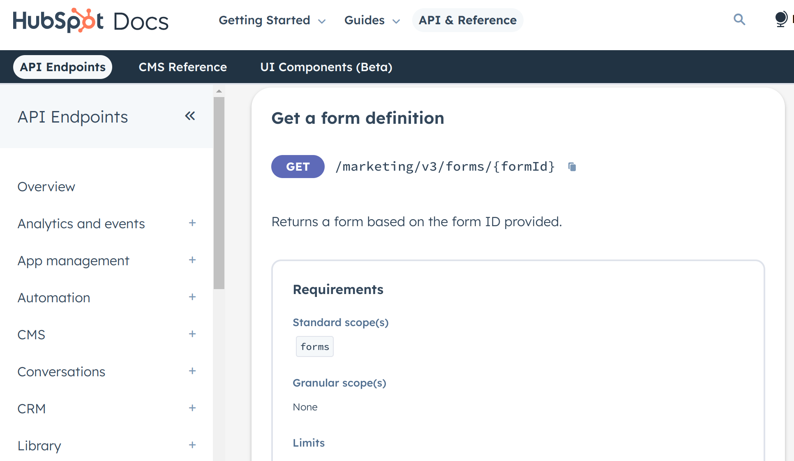
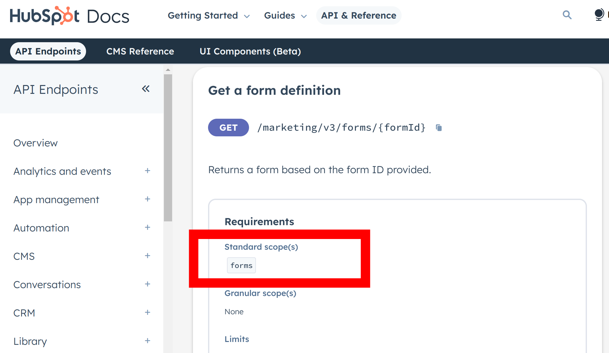

# Ballerina HubSpot Marketing Forms connector

[](https://github.com/ballerina-platform/module-ballerinax-hubspot.marketing.forms/actions/workflows/ci.yml)
[](https://github.com/ballerina-platform/module-ballerinax-hubspot.marketing.forms/actions/workflows/trivy-scan.yml)
[](https://github.com/ballerina-platform/module-ballerinax-hubspot.marketing.forms/actions/workflows/build-with-bal-test-graalvm.yml)
[](https://github.com/ballerina-platform/module-ballerinax-hubspot.marketing.forms/commits/master)
[](https://github.com/ballerina-platform/ballerina-library/labels/module%hubspot.marketing.forms)

## Overview

[HubSpot ](https://www.hubspot.com/) is an AI-powered customer platform with all the software, integrations, and resources you need to connect your marketing, sales, and customer service. HubSpot's connected platform enables you to grow your business faster by focusing on what matters most: your customers.

The `hubspot.marketing.forms` package offers APIs to connect and interact with [Marketing Forms API](https://developers.hubspot.com/docs/reference/api/marketing/forms) endpoints, enabling the creation, management, and embedding of forms to collect submissions from website visitors programmatically.

## Setup guide

[//]: # (TODO: Add detailed steps to obtain credentials and configure the module.)


[//]: # (TODO: Add detailed steps to obtain credentials and configure the module.)
To use the Hubpsot Automation action API connector in Ballerina, you must have a HubSpot developer account.

 ### Step 1: Create a Hubspot Developer Account

Visit the Hubspot portal (https://developers.hubspot.com/get-started) and create a Developer Account.

 ### Step 2: Create a Hubspot Developer Account

Create a Developer Test Account at (https://developers.hubspot.com/beta-docs/getting-started/account-types#developer-test-accounts)

 ### Step 3: Create a Hubspot Develop Test Account

Visit (https://developers.hubspot.com/beta-docs/getting-started/account-types#developer-test-accounts)and create a hubspot developer test account

 ### Step 4: Create a Hubspot Public App

In your developer account, navigate to the "Apps" section.

Click on "Create App" and provide the necessary details, including the app name and description.


 ### Step 5: Initiate the OAuth Flow

Move to the auth tab in the created app and set the permissions there .

Under the OAuth tab you can find the following details ,


client_id: Your app's Client ID.

redirect_uri: The URL users will be redirected to after granting access.

scope: A space-separated list of scopes your app is requesting.


### Step   6: Add the redirect URL
Add your redirect url under the redirect urls.


### Step   7: Add the Required Scopes

Go to the relevant API documentation (https://developers.hubspot.com/docs/reference/api/marketing/forms) and find out the required scopes.





Now come back to the Auth Page and add the required scopes under the Auth tab .




Now save the app 


### Step   8: Obtain the authorization code 

Copy the App installation url and paste it in the web browser. It will prompt you to install  the App and then select your deveper test account.

After selcting the developertest account, you will receive a authorization code displalyed in the browser.


### Step   9: Obtain the access token


Place your auhtorization code, client_id and client_screct in the folowing comand and execute it in the terminal

'curl --request POST \
  --url https://api.hubapi.com/oauth/v1/token \
  --header 'content-type: application/x-www-form-urlencoded' \
  --data 'grant_type=authorization_code&code=<code>&redirect_uri=http://localhost:9090&client_id=<client_id>&client_secret=<client_secret>'

If the command executes successfully , you will receive the access token from the response.


### Step 10 : Obtaining the developer API key .

Follow the instructions at (https://developers.hubspot.com/docs/api/developer-tools-overview#developer-api-keys) to obtain the developer API key.

## Quickstart

[//]: # (TODO: Add a quickstart guide to demonstrate a basic functionality of the module, including sample code snippets.)

## Examples

The `HubSpot Marketing Forms` connector provides practical examples illustrating usage in various scenarios. Explore these [examples](https://github.com/module-ballerinax-hubspot.marketing.forms/tree/main/examples/), covering the following use cases:

[//]: # (TODO: Add examples)

## Build from the source

### Setting up the prerequisites

1. Download and install Java SE Development Kit (JDK) version 21. You can download it from either of the following sources:

    * [Oracle JDK](https://www.oracle.com/java/technologies/downloads/)
    * [OpenJDK](https://adoptium.net/)

   > **Note:** After installation, remember to set the `JAVA_HOME` environment variable to the directory where JDK was installed.

2. Download and install [Ballerina Swan Lake](https://ballerina.io/).

3. Download and install [Docker](https://www.docker.com/get-started).

   > **Note**: Ensure that the Docker daemon is running before executing any tests.

4. Export Github Personal access token with read package permissions as follows,

    ```bash
    export packageUser=<Username>
    export packagePAT=<Personal access token>
    ```

### Build options

Execute the commands below to build from the source.

1. To build the package:

   ```bash
   ./gradlew clean build
   ```

2. To run the tests:

   ```bash
   ./gradlew clean test
   ```

3. To build the without the tests:

   ```bash
   ./gradlew clean build -x test
   ```

4. To run tests against different environments:

   ```bash
   ./gradlew clean test -Pgroups=<Comma separated groups/test cases>
   ```

5. To debug the package with a remote debugger:

   ```bash
   ./gradlew clean build -Pdebug=<port>
   ```

6. To debug with the Ballerina language:

   ```bash
   ./gradlew clean build -PbalJavaDebug=<port>
   ```

7. Publish the generated artifacts to the local Ballerina Central repository:

    ```bash
    ./gradlew clean build -PpublishToLocalCentral=true
    ```

8. Publish the generated artifacts to the Ballerina Central repository:

   ```bash
   ./gradlew clean build -PpublishToCentral=true
   ```

## Contribute to Ballerina

As an open-source project, Ballerina welcomes contributions from the community.

For more information, go to the [contribution guidelines](https://github.com/ballerina-platform/ballerina-lang/blob/master/CONTRIBUTING.md).

## Code of conduct

All the contributors are encouraged to read the [Ballerina Code of Conduct](https://ballerina.io/code-of-conduct).

## Useful links

* For more information go to the [`hubspot.marketing.forms` package](https://central.ballerina.io/ballerinax/hubspot.marketing.forms/latest).
* For example demonstrations of the usage, go to [Ballerina By Examples](https://ballerina.io/learn/by-example/).
* Chat live with us via our [Discord server](https://discord.gg/ballerinalang).
* Post all technical questions on Stack Overflow with the [#ballerina](https://stackoverflow.com/questions/tagged/ballerina) tag.
