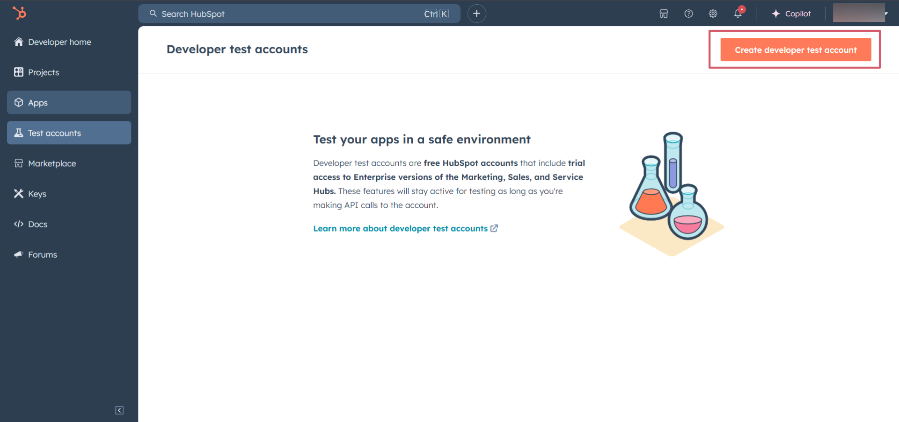
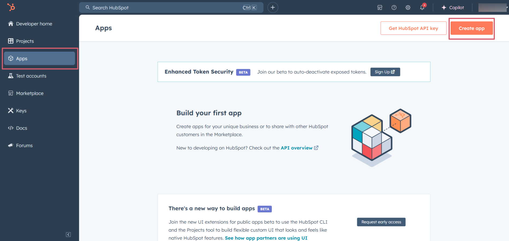
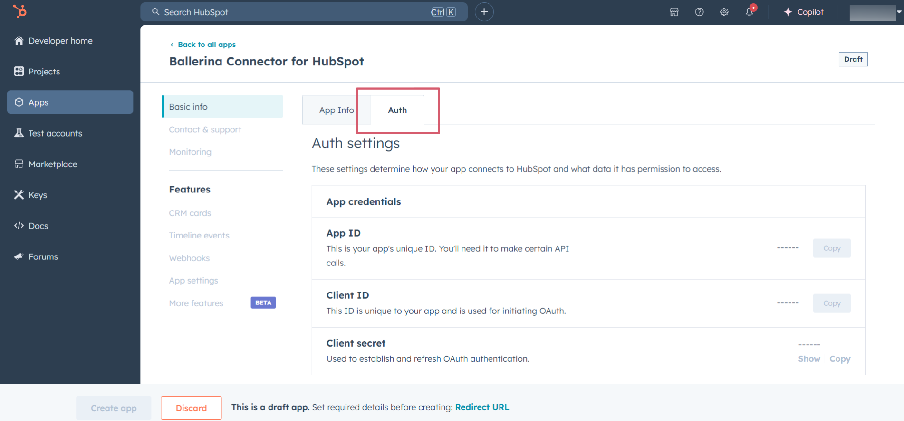
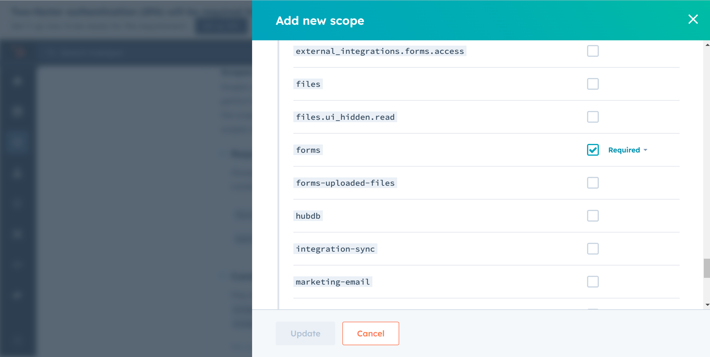
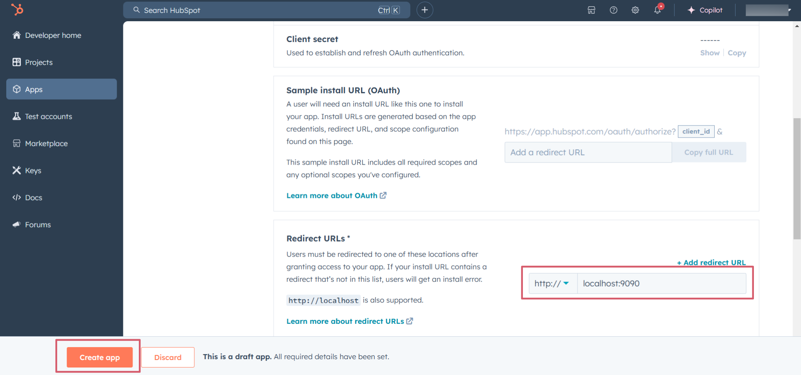
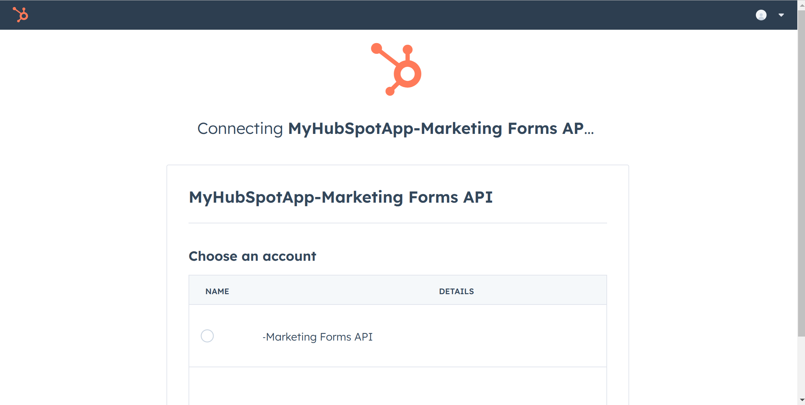

# Ballerina HubSpot Marketing Forms connector

[](https://github.com/ballerina-platform/module-ballerinax-hubspot.marketing.forms/actions/workflows/ci.yml)
[](https://github.com/ballerina-platform/module-ballerinax-hubspot.marketing.forms/actions/workflows/trivy-scan.yml)
[](https://github.com/ballerina-platform/module-ballerinax-hubspot.marketing.forms/actions/workflows/build-with-bal-test-graalvm.yml)
[](https://github.com/ballerina-platform/module-ballerinax-hubspot.marketing.forms/commits/master)
[](https://github.com/ballerina-platform/ballerina-library/labels/module%hubspot.marketing.forms)

## Overview

[HubSpot](https://www.hubspot.com/our-story) is a customer platform with all the software, integrations, and resources users need to connect thier marketing, sales, and customer service.

The `hubspot.marketing.forms` package offers APIs to connect and interact with [Marketing Forms API](https://developers.hubspot.com/docs/reference/api/marketing/forms) endpoints, specifically based on HubSpot API v3.

>**_NOTE:_**             
This package may be changed in the future based on the HubSpot API changes, since it is currently under development and is subject to change based on testing and feedback. By using this package, you are agreeing to accept any future changes that might occur and understand the risk associated with testing an unstable API.
Refer to the [HubSpot Developer Terms](https://legal.hubspot.com/developer-terms?_gl=1*fmuxuh*_ga*NDU4NDIxOTA5LjE3MzQ3ODM3Mjg.*_ga_LXTM6CQ0XK*MTczNDgwNjI1OS4yLjAuMTczNDgwNjI1OS42MC4wLjA.&_ga=2.66923502.174841559.1734639641-983296813.1734639641) & [Developer Beta Terms](https://legal.hubspot.com/developerbetaterms?_gl=1*fmuxuh*_ga*NDU4NDIxOTA5LjE3MzQ3ODM3Mjg.*_ga_LXTM6CQ0XK*MTczNDgwNjI1OS4yLjAuMTczNDgwNjI1OS42MC4wLjA.&_ga=2.66923502.174841559.1734639641-983296813.1734639641) for more information.

## Setup guide

To use the HubSpot Feedback connector, you must have access to the HubSpot API through a HubSpot developer account and a HubSpot App under it. Therefore you need to register for a developer account at HubSpot if you don't have one already.

### Step 1: Create/Login to a HubSpot Developer Account

If you have an account already, go to the [HubSpot developer portal](https://app.hubspot.com/)

If you don't have a HubSpot Developer Account you can sign up to a free account [here](https://developers.hubspot.com/get-started)

### Step 2 (Optional): Create a [Developer Test Account](https://developers.hubspot.com/beta-docs/getting-started/account-types#developer-test-accounts) under your account

Within app developer accounts, you can create developer test accounts to test apps and integrations without affecting any real HubSpot data.

**_These accounts are only for development and testing purposes. In production you should not use Developer Test Accounts._**

1. Go to Test accounts section from the left sidebar.


2. Click on the `Create developer test account` button on the top right corner.



3. In the pop-up window, provide a name for the test account and click on the `Create` button.


4. You will see the newly created test account in the list of test accounts.


### Step 3: Create a HubSpot App

1. Now navigate to the `Apps` section from the left sidebar and click on the `Create app` button on the top right corner.


2. Provide a public app name and description for your app.


### Step 4: Setup Authentication

1. Move to the `Auth` tab.




2. In the `Scopes` section, add the following scopes for your app using the `Add new scopes` button.
   - `forms`



3. In the `Redirect URL` section, add the redirect URL for your app. This is the URL where the user will be redirected after the authentication process. You can use localhost for testing purposes. Then hit the `Create App` button.



### Step 5: Get the Client ID and Client Secret

Navigate to the `Auth` tab and you will see the `Client ID` and `Client Secret` for your app. Make sure to save these values.


### Step 6: Setup Authentication Flow

Before proceeding with the Quickstart, ensure you have obtained the Access Token using the following steps:

1. Create an authorization URL using the following format:

   ```
   https://app.hubspot.com/oauth/authorize?client_id=<YOUR_CLIENT_ID>&scope=<YOUR_SCOPES>&redirect_uri=<YOUR_REDIRECT_URI>
   ```

   Replace the `<YOUR_CLIENT_ID>`, `<YOUR_REDIRECT_URI>` and `<YOUR_SCOPES>` with your specific value.

2. Paste it in the browser and select your developer test account to intall the app when prompted.

   

3. A code will be displayed in the browser. Copy the code.

   ```
   Received code: na1-129d-860c-xxxx-xxxx-xxxxxxxxxxxx
   ```

4. Run the following curl command. Replace the `<YOUR_CLIENT_ID>`, `<YOUR_REDIRECT_URI`> and `<YOUR_CLIENT_SECRET>` with your specific value. Use the code you received in the above step 3 as the `<CODE>`.

   - Linux/macOS

     ```bash
     curl --request POST \
     --url https://api.hubapi.com/oauth/v1/token \
     --header 'content-type: application/x-www-form-urlencoded' \
     --data 'grant_type=authorization_code&code=<CODE>&redirect_uri=<YOUR_REDIRECT_URI>&client_id=<YOUR_CLIENT_ID>&client_secret=<YOUR_CLIENT_SECRET>'
     ```

   - Windows

     ```bash
     curl --request POST ^
     --url https://api.hubapi.com/oauth/v1/token ^
     --header 'content-type: application/x-www-form-urlencoded' ^
     --data 'grant_type=authorization_code&code=<CODE>&redirect_uri=<YOUR_REDIRECT_URI>&client_id=<YOUR_CLIENT_ID>&client_secret=<YOUR_CLIENT_SECRET>'
     ```

   This command will return the access token necessary for API calls.

   ```json
   {
     "token_type": "bearer",
     "refresh_token": "<Refresh Token>",
     "access_token": "<Access Token>",
     "expires_in": 1800
   }
   ```

5. Store the access token securely for use in your application.

## Quickstart

[//]: # (TODO: Add a quickstart guide to demonstrate a basic functionality of the module, including sample code snippets.)

## Examples

The `HubSpot Marketing Forms` connector provides practical examples illustrating usage in various scenarios. Explore these [examples](https://github.com/module-ballerinax-hubspot.marketing.forms/tree/main/examples/), covering the following use cases:

[//]: # (TODO: Add examples)

## Build from the source

### Setting up the prerequisites

1. Download and install Java SE Development Kit (JDK) version 21. You can download it from either of the following sources:

    * [Oracle JDK](https://www.oracle.com/java/technologies/downloads/)
    * [OpenJDK](https://adoptium.net/)

   > **Note:** After installation, remember to set the `JAVA_HOME` environment variable to the directory where JDK was installed.

2. Download and install [Ballerina Swan Lake](https://ballerina.io/).

3. Download and install [Docker](https://www.docker.com/get-started).

   > **Note**: Ensure that the Docker daemon is running before executing any tests.

4. Export Github Personal access token with read package permissions as follows,

    ```bash
    export packageUser=<Username>
    export packagePAT=<Personal access token>
    ```

### Build options

Execute the commands below to build from the source.

1. To build the package:

   ```bash
   ./gradlew clean build
   ```

2. To run the tests:

   ```bash
   ./gradlew clean test
   ```

3. To build the without the tests:

   ```bash
   ./gradlew clean build -x test
   ```

4. To run tests against different environments:

   ```bash
   ./gradlew clean test -Pgroups=<Comma separated groups/test cases>
   ```

5. To debug the package with a remote debugger:

   ```bash
   ./gradlew clean build -Pdebug=<port>
   ```

6. To debug with the Ballerina language:

   ```bash
   ./gradlew clean build -PbalJavaDebug=<port>
   ```

7. Publish the generated artifacts to the local Ballerina Central repository:

    ```bash
    ./gradlew clean build -PpublishToLocalCentral=true
    ```

8. Publish the generated artifacts to the Ballerina Central repository:

   ```bash
   ./gradlew clean build -PpublishToCentral=true
   ```

## Contribute to Ballerina

As an open-source project, Ballerina welcomes contributions from the community.

For more information, go to the [contribution guidelines](https://github.com/ballerina-platform/ballerina-lang/blob/master/CONTRIBUTING.md).

## Code of conduct

All the contributors are encouraged to read the [Ballerina Code of Conduct](https://ballerina.io/code-of-conduct).

## Useful links

* For more information go to the [`hubspot.marketing.forms` package](https://central.ballerina.io/ballerinax/hubspot.marketing.forms/latest).
* For example demonstrations of the usage, go to [Ballerina By Examples](https://ballerina.io/learn/by-example/).
* Chat live with us via our [Discord server](https://discord.gg/ballerinalang).
* Post all technical questions on Stack Overflow with the [#ballerina](https://stackoverflow.com/questions/tagged/ballerina) tag.
